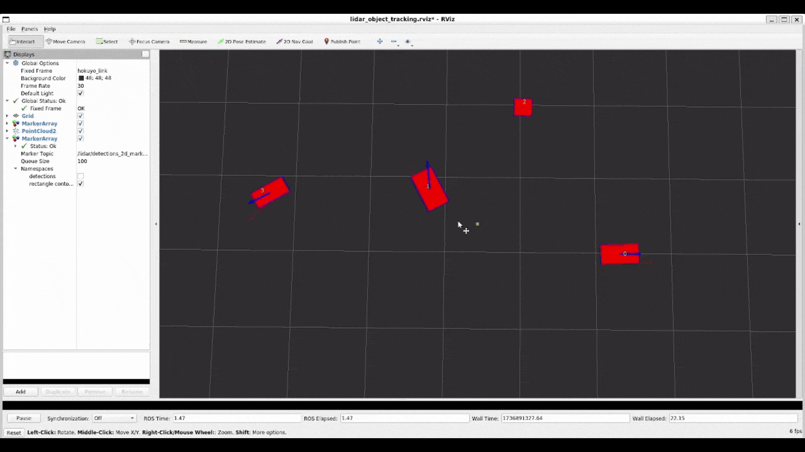
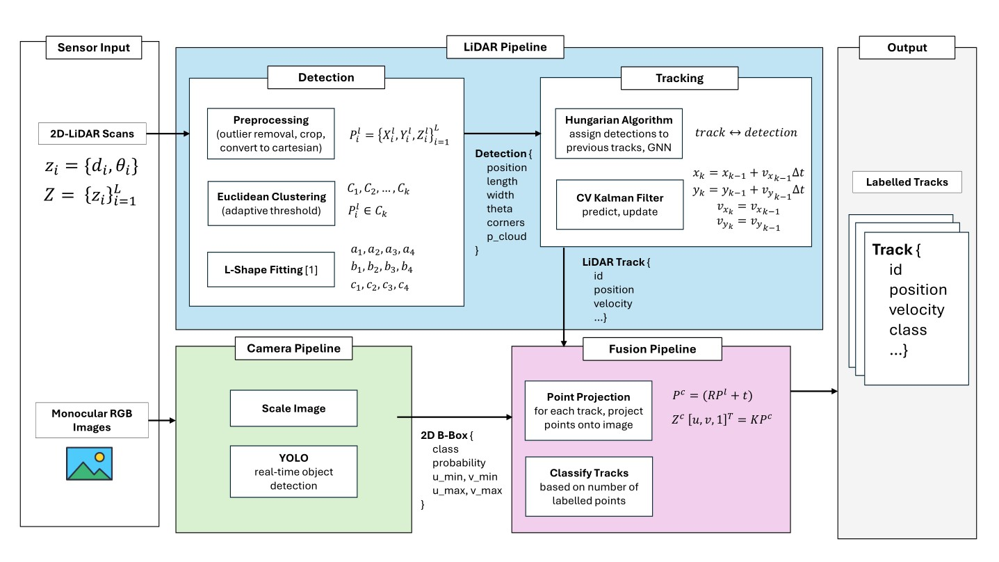
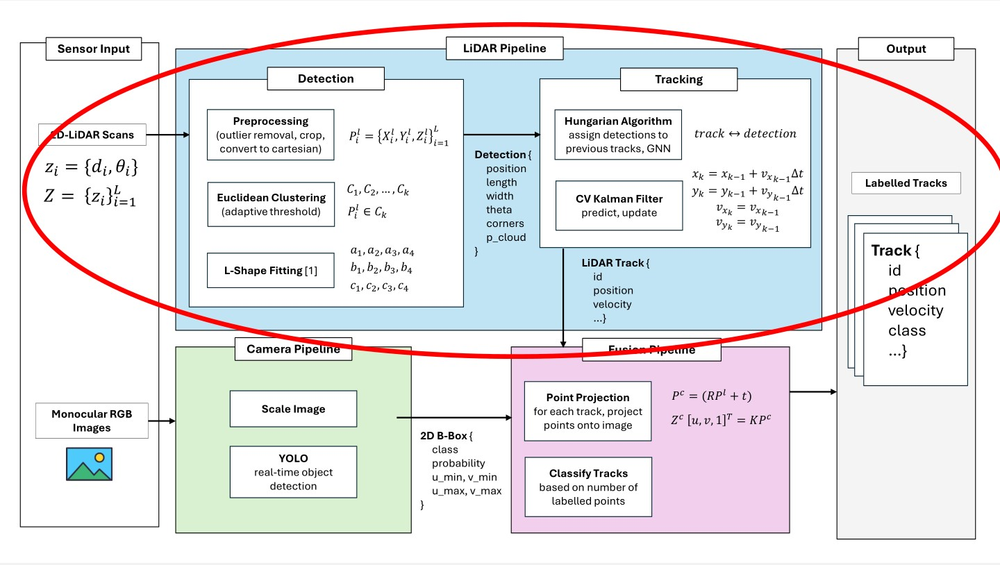

# 2D-LiDAR-MOT
A pipeline for 2D multi-object tracking using a laser scanner. See [slides](assets/slides.pdf).



## Idea
The diagram below describes a pipeline for multi-object **tracking** and **classification** using a camera and laser scanner. The idea was to use the geometric information from the laser scanner for detection and tracking and use the semantic information from the camera for classification.



## Implementation
This repo only implements the multi-object tracking part of the pipeline (circled in red below) and does not include classification.



Multiple ROS packages are contained in this repo, as described below.

- `custom_msgs`: Contains custom messages used by other packages.
- `lidar_object_detection`: Contains nodes for preprocessing scan data, detecting objects, and visualizing detected objects. 
- `lidar_object_tracking`: Contains nodes for tracking detected objects and visualizing tracks.
- `perception_launch`: The entrypoint of the pipeline. Contains launch files for launching relevant nodes.
- `perception_validate`: Unfinished. Contains a node that evaluates the effectiveness of the tracker by comparing the published tracks with ground truth (from Gazebo).
- `racecar_description`: Contains the description files (URDF) for a racecar equipped with a laser scanner.
- `racecar_gazebo`: Contains files for launching a simple Gazebo world with an ego racecar and some actors.

## Environment Setup
**ROS Version**: Noetic <br>
**System Requirements**: Ubuntu 20.04 (or with Docker)

I recommend using Docker to run your nodes. You can use the `Dockerfile` and `docker-compose.yml` from [this repo](https://github.com/chungdavid/ros-docker-setup).
```bash
git clone https://github.com/chungdavid/ros-docker-setup
git clone https://github.com/chungdavid/2D-LiDAR-MOT.git workspace/src
```

After the above steps, your file structure should look like:
```
ros-docker-setup/
workspace/
└─ src/
   ├─ custom_msgs/
   ├─ lidar_object_detection/
   ├─ lidar_object_tracking/
   ├─ perception_launch/
   ├─ perception_validate/
   ├─ racecar_description/
   └─ racecar_gazebo/
```

Start and enter the Docker container. All packages should already be built, and you should be in the `~/workspace` directory.
```
cd ros-docker-setup
docker compose up -d dev
docker exec -it ros_noetic_dev /bin/bash
```

If needed, you can build the packages with
`catkin build` from the `~/workspace` directory.

## Running the Nodes
The `perception_launch` package contains the relevant launch files for starting the pipeline. Be sure to start the master node first with `roscore`.

The following command starts the Gazebo world and runs the pipeline on synthetic scan data.
```bash
roslaunch perception_launch lidar_perception_gazebo.launch
```

## Improvements
Many challenges/room for improvement are outlined in the [slides](assets/slides.pdf). Some potential improvements:
- The tracker only tracks linear position and velocity of the object's center using a constant velocity model Kalman Filter. Angular position and velocity ($\theta$, $\omega$) can be tracked with an Extended Kalman Filter using a constant velocity turn model.
- The L-Shape fitting algorithm only outputs orientations between 0-90 degrees, which makes objects difficult to track when they start rotating beyond that region. More importantly, orientation may be ambiguous and the detected length and width may suddenly switch, as outlined in slides 51-53. For example, an object that is not rotated can either be at 0 degrees or 90 degrees with their lengths and widths swapped.
   - Tracking $\theta$ may help with this challenge, since we can use our knowledge of the object's movement to inform it's orientation. Note that will need to assuming the object is always oriented in the direction it's moving. Additionally, we can use our knowledge of the tracked $\theta$ to address when sides suddenly swap. 
- The detected L-Shape tends to "jump" between frames as the object's position changes relative to the laser scanner. As a result, the calculated center of the object also jumps between frames, as explained in slides 29-34. Since the center of objecs are tracked, this jump can be problematic.
   - Can we use our knowledge of where the object is relative to the laser scanner (i.e. if it's in front, to the side, diagonal, etc.) to account for these jumps?
- Athough the camera pipeline is not implemented, it could be designed to be more integrated with tracking rather than being a separate process for classification. We can leverage the semantic information from the camera to address identity switching, which was brought up in slide 35.
